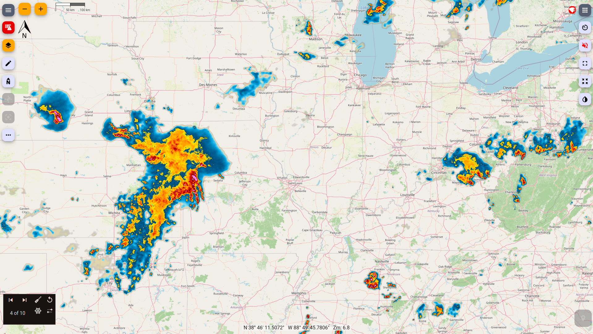

# signalk-rainviewer-charts

[](https://www.npmjs.com/package/signalk-rainviewer-charts)
[](https://github.com/Tominouu/signalk-rainviewer-charts/actions/workflows/publish.yml)

A [Signal K](https://signalk.org/) server plugin that provides live weather radar tiles from [RainViewer](https://www.rainviewer.com/) as chart resources.



Once installed, RainViewer appears as a selectable chart layer in any Signal K client that supports the resources/charts API (e.g. [Freeboard-SK](https://github.com/SignalK/freeboard-sk), [KIP](https://github.com/SignalK/kip/)).

## Install

```bash
npm install signalk-rainviewer-charts
```

Or install via the Signal K Server App Store (Plugin Config → Available).

## Usage

1. Enable the plugin in the Signal K Server admin UI (Plugin Config).
2. In Freeboard-SK (or other chart-capable client), open the chart list.
3. Find **RainViewer Radar** and enable it.

The tile URL is automatically refreshed every 10 minutes.

## How it works

- Periodically fetches the latest radar composite frame URL from `https://api.rainviewer.com/public/weather-maps.json`.
- Registers itself as a `charts` resource provider via `app.resourcesApi.register()`.
- Serves the RainViewer tile layer as a standard XYZ chart resource — no configuration needed.

## Data source

RainViewer provides global composite weather radar imagery from multiple national networks. Tiles update approximately every 2.5–10 minutes depending on region.

## License

Apache-2.0
